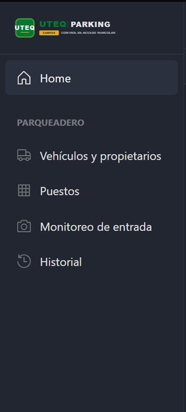
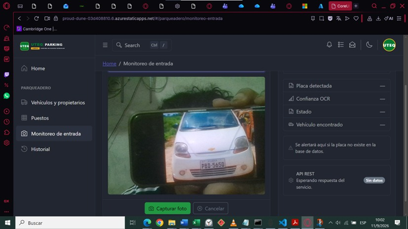
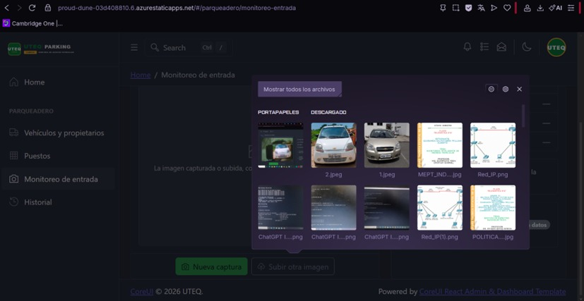
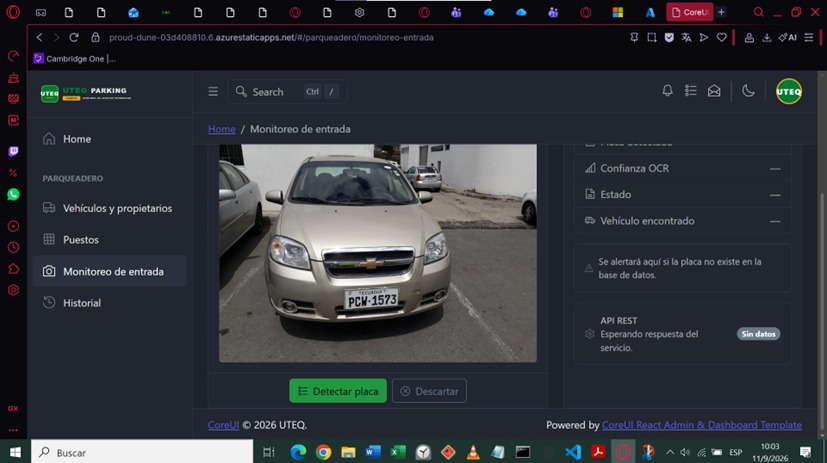
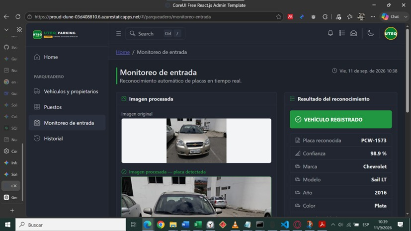
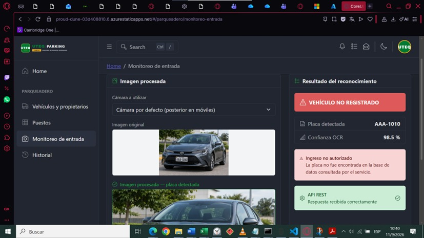
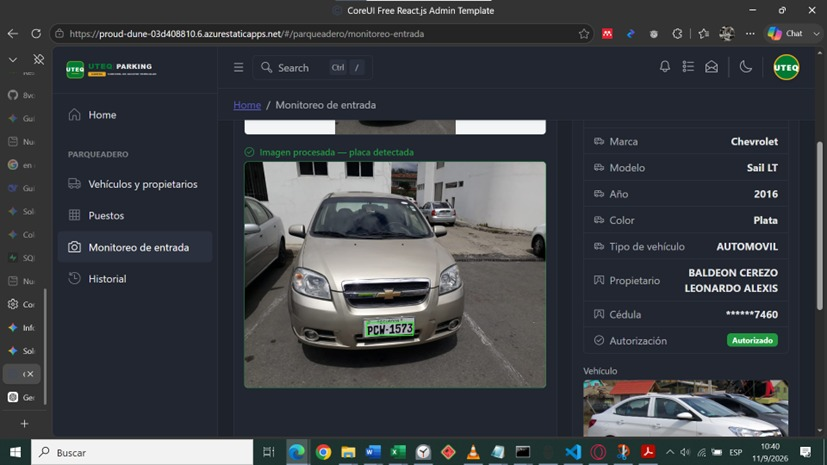
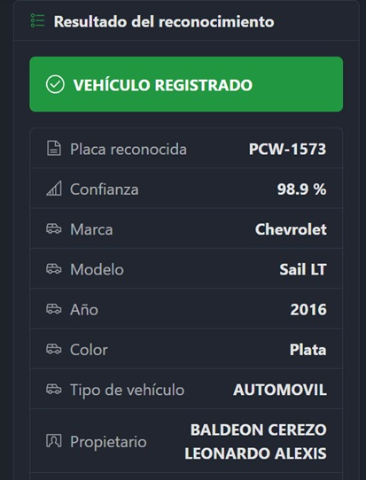
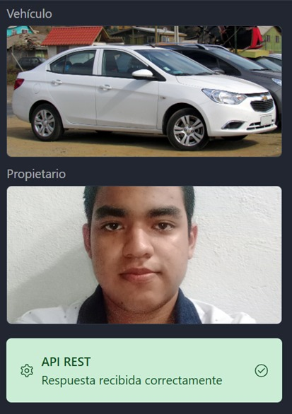

# UTEQ Smart Parking Panel Administrativo


Panel administrativo desarrollado con React, Vite y CoreUI para gestionar y supervisar el flujo del parqueadero universitario UTEQ Smart Parking. El sistema se conecta a Supabase para consultar vehículos autorizados, visualizar ocupación de puestos, revisar historial y ejecutar reconocimiento automático de placas desde imágenes.

## Descripción general

Este proyecto corresponde a un panel de administración para el control de acceso y gestión del estacionamiento de la UTEQ. Integra varias funcionalidades clave para la supervisión operativa del parqueadero:

- Consulta y gestión de vehículos autorizados.
- Visualización de puestos y estado de ocupación.
- Monitoreo de entrada con captura desde cámara o archivo.
- Reconocimiento óptico de caracteres para placas.
- Historial de acciones y cambios del sistema.
- Consulta en tiempo real a través de Supabase y Realtime.

## Funcionalidades implementadas

### 1. Vehículos y propietarios

Ruta principal:

```text
/parqueadero/vehiculos
```

Incluye:

- Listado de vehículos autorizados desde Supabase.
- Búsqueda por placa, marca, modelo, color, propietario o correo.
- Paginación de 10 elementos por página.
- Fotografía del vehículo y del propietario.
- Información del propietario con cédula enmascarada.
- Estado de autorización del vehículo.
- Botón de actualización para recargar datos.
- Acciones de creación, edición y retiro de vehículos cuando corresponda.

### 2. Gestión de puestos

Ruta:

```text
/parqueadero/puestos
```

Incluye:

- Vista del estado de cada puesto del parqueadero.
- Conteo total, libres, ocupados y porcentaje de disponibilidad.
- Filtros por estado y columna.
- Creación, edición y eliminación de puestos.
- Marcado de puestos como ocupados o disponibles.
- Visualización del estado operativo en tiempo real.

### 3. Monitoreo de entrada

Ruta:

```text
/parqueadero/monitoreo-entrada
```

Incluye:

- Captura de imagen desde cámara o selección local.
- Validación de archivos antes del proceso.
- Envío de la imagen al servicio OCR configurado.
- Reconocimiento automático de la placa.
- Visualización del resultado con la imagen marcada.
- Manejo de errores y mensajes de validación.

### 4. Historial de cambios

Ruta:

```text
/parqueadero/historial
```

Incluye:

- Historial de vehículos.
- Historial de puestos.
- Auditoría de modificaciones realizadas en el sistema.

## Tecnologías utilizadas

- React 19
- Vite
- CoreUI React
- Supabase JavaScript Client
- Sass
- JavaScript ES modules

## Variables de entorno

Crear un archivo `.env.local` en la raíz del proyecto con las variables necesarias:

```dotenv
VITE_SUPABASE_URL=https://TU_PROYECTO.supabase.co
VITE_SUPABASE_PUBLISHABLE_KEY=tu_clave_publica
VITE_OCR_ENDPOINT=https://tu-endpoint-ocr.example.com/api/reconocer
```

Importante:

- No publicar claves secretas ni la clave `service_role`.
- Mantener `.env.local` fuera del control de versiones.
- El servicio OCR debe estar configurado para la funcionalidad de monitoreo de entrada.

## Instalación y ejecución

Instalar dependencias:

```powershell
npm install
```

Ejecutar la aplicación en modo desarrollo:

```powershell
npm start
```

Abrir la aplicación en el navegador:

```text
http://localhost:5173
```

Rutas relevantes:

```text
http://localhost:5173/dashboard
http://localhost:5173/parqueadero/vehiculos
http://localhost:5173/parqueadero/puestos
http://localhost:5173/parqueadero/monitoreo-entrada
http://localhost:5173/parqueadero/historial
```

Generar compilación para producción:

```powershell
npm run build
```

## Estructura principal del proyecto

```text
src/
├── _nav.jsx                         # Menú lateral del panel
├── routes.js                        # Definición de rutas
├── lib/
│   └── supabase.js                  # Cliente Supabase
├── hooks/
│   ├── useVehiculos.js              # Consulta de vehículos
│   ├── usePuestos.js                # Gestión de puestos
│   ├── useHistorial.js              # Historial del sistema
│   └── useCamera.js                 # Captura de cámara
├── services/
│   └── ocrService.js                # Integración OCR
├── views/
│   └── parqueadero/
│       ├── ListaVehiculos.jsx       # Vista de vehículos
│       ├── Puestos.jsx              # Vista de puestos
│       ├── MonitoreoEntrada.jsx     # Captura y OCR
│       └── Historial.jsx           # Historial general
├── components/
│   └── ...
├── assets/
└── scss/
```

## Galería de pantallas y funcionamiento

Las siguientes capturas muestran el flujo visual del sistema desde que se accede al módulo de monitoreo hasta la validación del vehículo. Cada imagen representa una etapa del proceso de control del parqueadero.

### 1. Nueva opción del menú



La interfaz incorpora una nueva opción dentro del menú lateral llamada "Monitoreo de entrada". Esta acción permite acceder rápidamente al módulo que gestiona la captura de imágenes y el reconocimiento de placas. El propósito es centralizar todo el flujo de revisión visual del parqueadero en una ruta específica del panel administrativo.

### 2. Captura de la cámara funcionando



Aquí se observa cómo el sistema activa la cámara del dispositivo para obtener una imagen en tiempo real. La vista está lista para tomar una fotografía del vehículo que ingresa al estacionamiento. La aplicación valida el entorno antes de usar la cámara y prepara la imagen para enviarla al proceso de reconocimiento óptico.

### 3. Captura de una imagen seleccionada desde el dispositivo



En esta etapa el usuario puede elegir una imagen ya guardada en el equipo, en lugar de usar la cámara. El sistema permite cargar archivos locales y validar que sean imágenes válidas. Una vez seleccionada, se muestra una vista previa para confirmar que la imagen corresponde al vehículo a analizar.



La segunda parte de esta captura muestra la imagen ya cargada y lista para ser procesada. En este punto el sistema prepara la información para enviar la foto al servicio OCR, que analizara la placa y extraerá los datos del vehículo a partir de la imagen.

### 4. Captura de un vehículo registrado



Este caso representa un vehículo que sí se encuentra en el sistema de registros autorizados. Cuando la placa es reconocida correctamente, la aplicación compara la información con las bases de datos del proyecto y puede identificar si el vehículo tiene autorización para ingresar o no. Este paso es clave para realizar la validación automática.

### 5. Captura de un vehículo no registrado



En este flujo el sistema detecta una placa que no coincide con un registro autorizado del parqueadero. Esto permite identificar vehículos no registrados o no autorizados. El módulo sirve como apoyo para revisión manual o para decidir si se debe registrar la entrada, bloquear el ingreso o notificar al administrador.

### 6. Imagen del vehículo con la placa marcada



Una vez que la imagen es analizada, la aplicación marca la zona correspondiente a la placa para visualizar el reconocimiento realizado por el OCR. Esta función ayuda a verificar que la lectura fue correcta y que el sistema ubicó la zona relevante de la imagen antes de extraer la matrícula.

### 7. Datos del vehículo y propietario



Después del reconocimiento, el sistema consulta la información asociada al vehículo y al propietario. Se muestran datos como la placa, marca, modelo, año, color, tipo de vehículo y el nombre del responsable. En esta parte también se verifica la coincidencia entre la placa detectada y el registro almacenado en Supabase.



La segunda parte completa la vista con los datos del propietario, información institucional y la relación con el vehículo autorizado. Esto permite que el administrador tenga una vista rápida y clara del estado del automóvil, quien es el titular y si la información corresponde a un registro válido dentro del sistema del parqueadero.

## Funcionamiento general del flujo

1. El usuario accede al módulo de monitoreo desde el menú lateral.
2. El sistema activa la cámara o permite cargar una imagen desde el dispositivo.
3. Se valida que la imagen sea correcta y correspondiente a un vehículo.
4. La imagen es enviada al servicio OCR para reconocer la placa.
5. El sistema extrae la matrícula y compara la información con la base de datos.
6. Si existe un vehículo registrado, se muestran sus datos y los del propietario.
7. Si no existe, la aplicación indica que la placa no está autorizada o no se encuentra registrada.
8. La interfaz ayuda a la administración a supervisar la entrada de vehículos y verificar el estado del parqueadero.

## Flujo de trabajo del sistema

1. El panel consulta los datos de vehículos y puestos desde Supabase.
2. Los administradores pueden filtrar, buscar y revisar información detallada.
3. El módulo de puestos refleja el estado actual del estacionamiento.
4. La cámara o un archivo cargado permiten reconocer placas mediante OCR.
5. El historial conserva un registro de cambios relevantes para auditoría.

## Verificación funcional

Con el entorno configurado y las tablas correspondientes en Supabase, se puede comprobar que:

1. Se cargan los vehículos autorizados correctamente.
2. Los datos del propietario y del vehículo se visualizan en la tabla.
3. Los puestos muestran su estado real y disponibilidad.
4. La captura de imágenes funciona desde cámara o archivo.
5. El OCR reconoce placas y devuelve la información esperada.
6. El historial refleja los cambios realizados en el sistema.
7. La aplicación puede ejecutarse desde el entorno de desarrollo con Vite.

## Nota

Este panel fue desarrollado como solución administrativa para supervisar y gestionar un sistema de estacionamiento inteligente, combinando consultas en tiempo real, monitoreo visual y procesamiento OCR para apoyar la operación del parqueadero.
